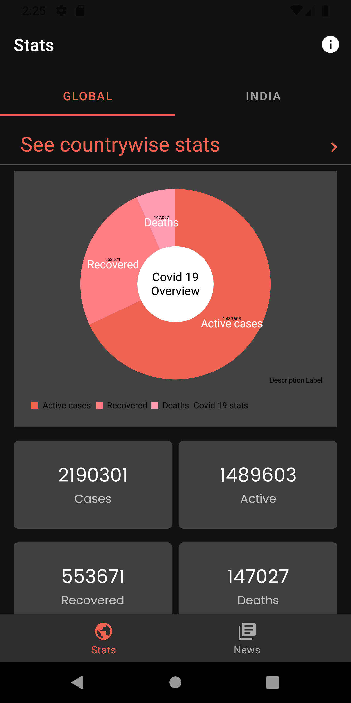
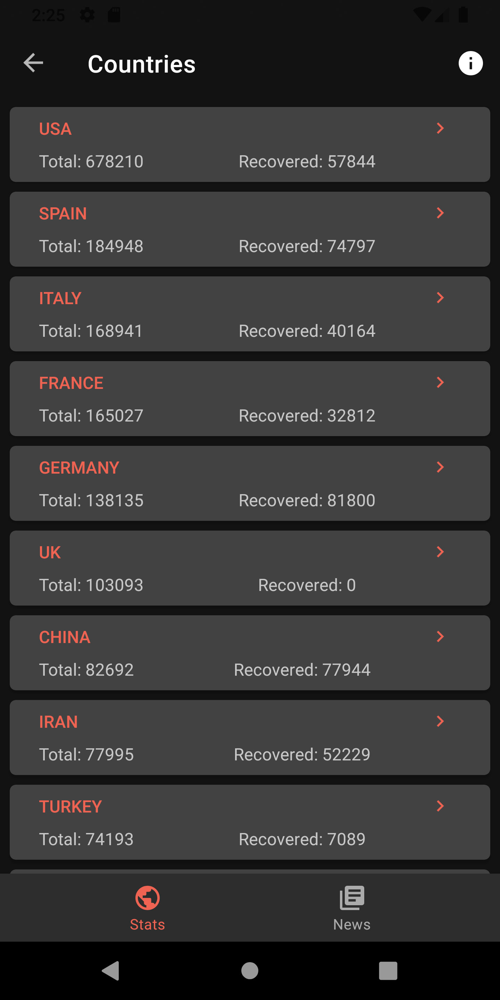
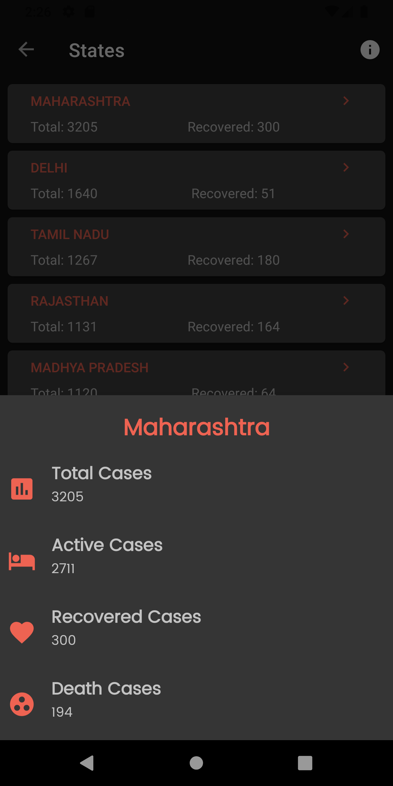

# Coview : The Covid-19 Tracker
Coview is covid 19 tracker which provides you stats and news related to covid 19.

## Download
Download link

## Features
- Global covid 19 stats
- Country wise stats
- Covid 19 stats specific to India and statewise stats
- News articles related to covid 19
- ...and many more to come in near future

## Screenshots

## License
    Coview: Covid 19 tracker app
    Copyright (C) 2020  Rohit Kailas Chaudhari

    This Coview is free software: you can redistribute it and/or modify
    it under the terms of the GNU General Public License as published by
    the Free Software Foundation, either version 3 of the License, or
    (at your option) any later version.

    This program is distributed in the hope that it will be useful,
    but WITHOUT ANY WARRANTY; without even the implied warranty of
    MERCHANTABILITY or FITNESS FOR A PARTICULAR PURPOSE.  See the
    GNU General Public License for more details.

    You should have received a copy of the GNU General Public License
    along with this program.  If not, see <https://www.gnu.org/licenses/>.

